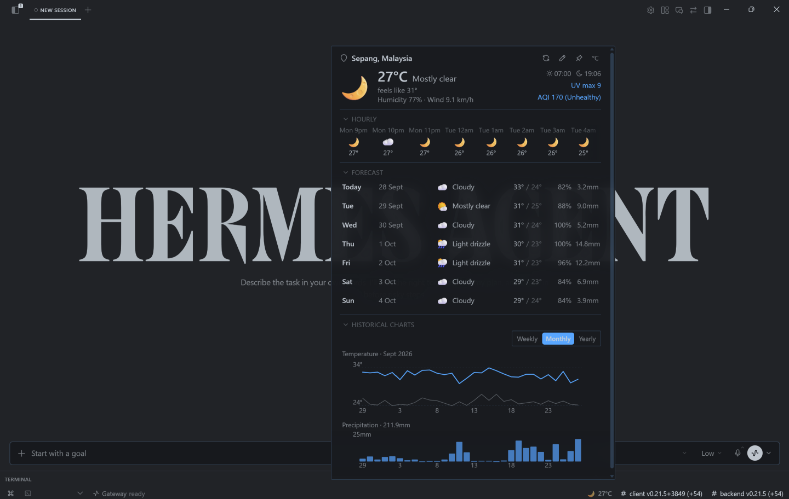
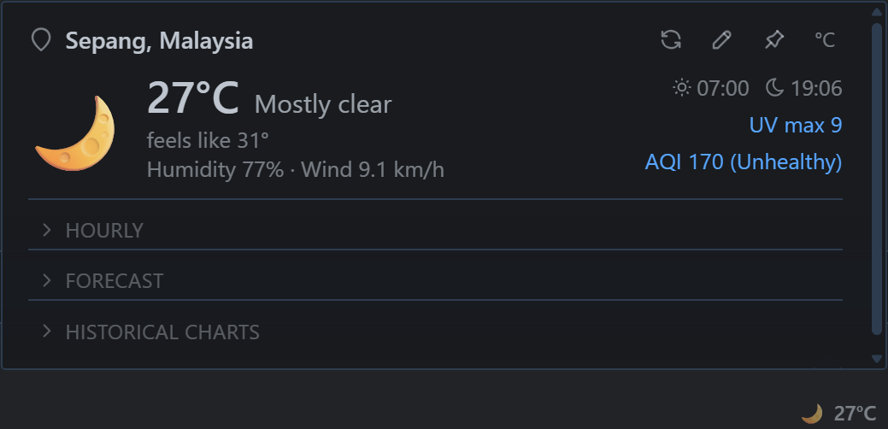
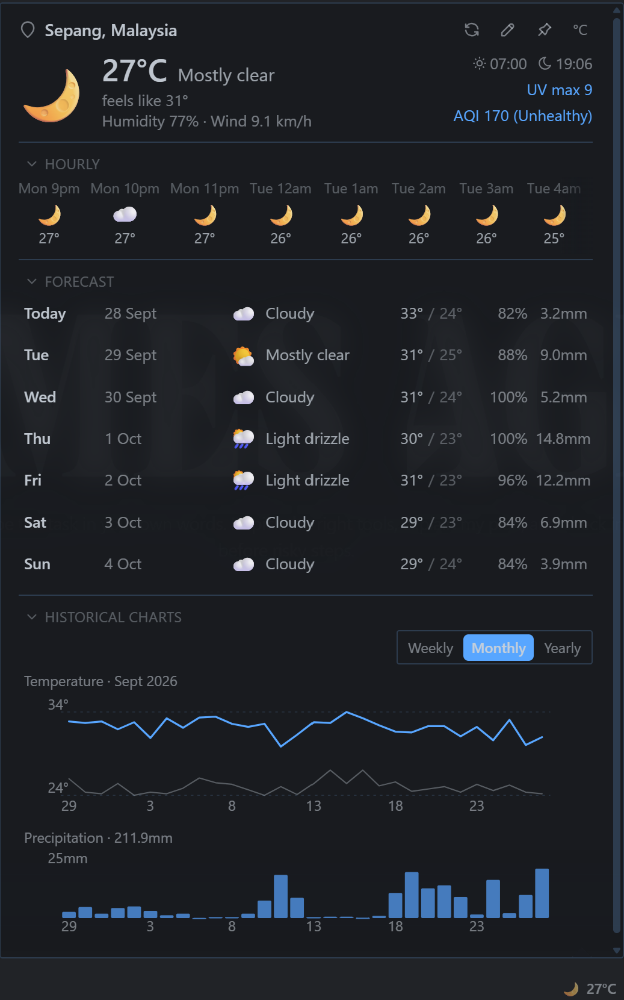
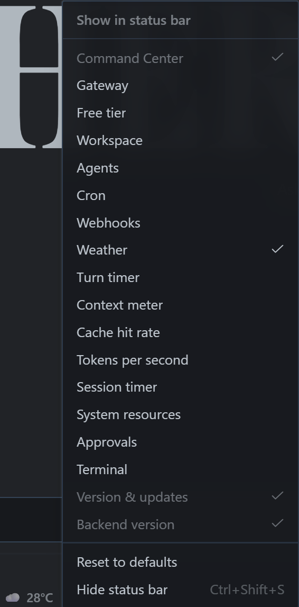

# Weather Widget for Hermes Desktop

A weather chip that lives in your status bar. Click the temperature to see current conditions, an hourly strip you can scroll, a 7-day forecast, and temperature/precipitation historical charts, all in one panel.

  

## What it does

**Status bar chip**: shows the current temperature and condition icon (e.g. `🌙 27°C`). Click to open the popover, and you can hide or show it at any time from the bar's right-click menu under **Show in status bar** → **Weather**.

**Popover**: four collapsible sections:

- **Current**: temperature, feels-like, humidity, wind, sunrise/sunset, UV index, AQI
- **Hourly**: scrollable ~48-hour strip around the current hour (24 hours back and 24 hours ahead), drag or wheel to scroll, opens at the current hour
- **Forecast**: 7 days with high & low temperature, rain probability, and total precipitation; hover a row for that day's rain windows
- **Historical charts**: temperature and precipitation over 7 days, 30 days, or 12 months; aligned x-axes, hover for exact values

  &nbsp;&nbsp;&nbsp;
  

**Location**: type a city or pin up to 3 saved locations for quick switching. Optional IP auto-detect is **off by default** and opt-in. When on, the widget shows an `auto · on` badge whose tooltip discloses it uses your public IP via ipwho.is.

**Units**: °C/°F and km/h/mph toggle. Data stays metric internally; conversion is view-only.

**Theme-aware**: uses the app's CSS variables so it works in light, dark, or any theme without hardcoded colors.

**Moving the chip**: this is not a setting, it is one word in `desktop/plugin.js`. Change `STATUSBAR_AREAS.right` to `STATUSBAR_AREAS.left` and save; the file is watched, so the bar rebuilds in place and your settings are untouched.

  

## Install

1. Install the plugin, either way:

   - **From the app**: **Capabilities → Plugins** → **Install from Git** → paste `https://github.com/Fai256/weather-widget`
   - **By hand**: copy `desktop/plugin.js` into your desktop-plugins folder:

     - **Windows**: `%USERPROFILE%\.hermes\desktop-plugins\weather\plugin.js`
     - **Linux/macOS**: `~/.hermes/desktop-plugins/weather/plugin.js`

     The folder must be named `weather` and the file must be named `plugin.js` exactly.

2. Nothing else: the plugins folder is watched, so the chip appears within a few seconds. If it does not, use **Rescan** in **Capabilities → Plugins**.

3. The widget appears on the right of the status bar. Hover the chip to confirm the build (`v2.0`).

## Requirements

- Hermes Desktop 0.21.3 or later (Windows/macOS/Linux)
- Internet connection for weather data (Open-Meteo and ipwho.is, both free, no keys, CORS enabled)

## How it works (briefly)

- **Data**: Open-Meteo for weather (forecast, historical archive, air quality, and the city search) plus ipwho.is for IP geolocation, called only while auto-location is on
- **No chart libraries**: everything is hand-drawn inline SVG
- **No build step**: plain ES module, loads directly
- **Safe by default**: every API call has a timeout, a missing value is skipped rather than drawn as zero, and a bad location never breaks the UI

## Configuration

All settings persist automatically:

- Display units (°C/°F, km/h/mph)
- Auto-location on/off (default off, opt-in, calls ipwho.is with your public IP when on)
- Saved locations (up to 3, newest first)
- Section collapsed/expanded state
- Status bar show/hide (right-click the bar → **Show in status bar** → **Weather**)

## License

MIT. Do whatever you want with it.

---

*Built for Hermes Desktop. If you find it useful, a star on the repo helps others discover it.*
